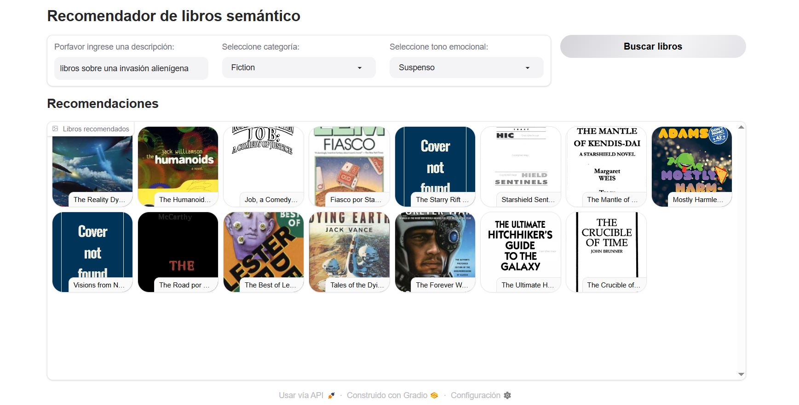

# Recomendador de Libros Semántico

El presente sistema de recomendación de libros está desarrollado utilizando LLM, base de datos vectorial y Gradio para la interfaz gráfica, los pasos para su desarrollo se presentan en los notebooks, desde la extracción, exploración y preprocesamiento de datos hasta la clasificación de texto, análisis de sentimientos y finalmente su despliegue.

Desarrollado usando Python, Gradio, LangChain, ChromaDB, y OpenAIEmbeddings.



### **📚 Demo del proyecto:** 
Presiona clic aquí para usarlo: [:book: Recomendador de libros](https://huggingface.co/spaces/diegosruiz18/book-recommendations)  

En caso de no ver la aplicación, hacer clic en el botón **"Restart Space"**.

## Objetivo:

Este sistema está diseñado para recomendar libros en base a una **descripción personalizada que el usuario ingresa**, una vez realizado ello el sistema devuelve los títulos relevantes o relacionados al tema de interés del usuario. Adicionalmente, se pueden aplicar filtros por categoría y tono emocional de las obras.

## Funcionamiento:

1. El usuario escribe una **descripción en español** sobre el tipo de libro de su interés.
2. La descripción se traduce al inglés a fin de emparejar con la base de datos.
3. Se convierte en un vector utilizando **OpenAIEmbeddings**.
4. Se realiza una búsqueda semántica en la base de datos vectorial **ChromaDB**.
5. Los resultados se filtran por **categoría** y **tono emocional**.
6. Se muestran los libros recomendados en una galería con portada, título, autor y descripción (este último en español).

### ¿Cómo usarlo?

- Describe un libro o un tema que te interesa (ej. *una historia sobre la segunda guerra mundial*).
- Filtra por categoría (ficción, no ficción, etc).
- Ordena por tono emocional de las obras (tristeza, felicidad, suspenso, etc).
- Visualiza y selecciona cualquier libro de la galería para ver más detalles.


## Desarrollo:

### Preparación de datos
- Fuente de datos: Kaggle
- Extracción y limpieza de datos de texto en ```data_exploration.ipynb```

### Búsqueda vectorial
- Búsqueda semántica vectorial y construcción de la base de datos vectorial en ```vector_search.ipynb```
- Se buscan los libros más similares a una consulta de lenguaje natural (por ejemplo, "un libro sobre la naturaleza y animales").

### Clasificación de texto
- Clasificación de texto usando clasificación de disparo cero en ```text_classification.ipynb```
- Se clasifican los libros como "ficción" o "no ficción", de tal manera que los usuarios puedan filtrar los libros.

### Análisis de sentimientos
- Se utiliza LLM para extraer las emociones del texto en ```sentiment_analysis.ipynb```, 
- Se ordenan los libros según su tono, por ejemplo: qué tan llenos de suspenso, alegres o tristes son los libros.

### Aplicación web y despliegue
- Creación de una aplicación web con Gradio para que los usuarios interactúen con el sistema en ```dashboard_gradio.py```.
- Despliegue de la aplicación en Hugging Face.

## Tecnologías utilizadas:

- **Python** (PyCharm)
- **Gradio** (interfaz de usuario)
- **LangChain** y **Chroma** (base de datos vectorial)
- **OpenAI Embeddings** (modelo `text-embedding-ada-002`)
- **Traducción con GPT-3.5 turbo**
- **Librerías:** pandas, numpy, matplotlib, seaborn
- **Hugging Face Spaces**

Todas las dependencias se proporcionan en el archivo requirements.txt
